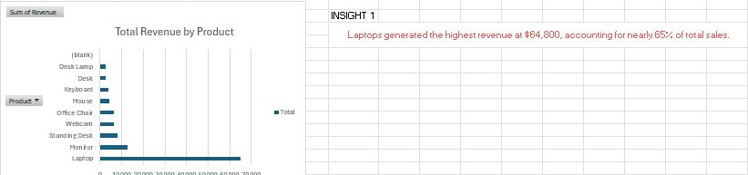
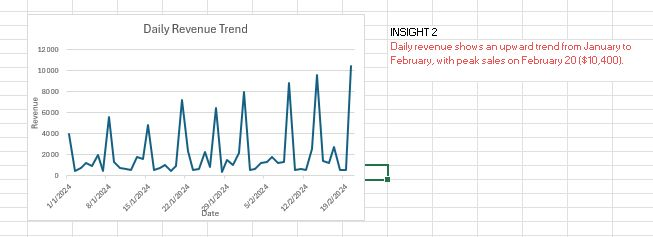
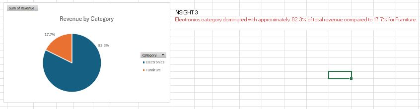

# Aizat's PortFolio

# [Project 1: Smart Lock for College Dormitory](https://drive.google.com/drive/u/0/folders/16KnzKFdijGOhvd8_ooLDtE9l6nYWSLjk)

This project was done in the last year of my degree as my Final Year Project (FYP), and I completed my thesis for it.

* Basically, this smart lock needs credentials from the student to unlock their dorm.
* This project uses a User Acceptance Test for real-time data.
* The project uses Firebase as a database and Arduino IDE software for the smart lock system coding.
* The Project Write-up is on. [Google Drive](https://drive.google.com/drive/u/0/folders/1Ji4Nwgbun82o7UC3q4NQHcKVIgrBwR9-)

## Overview of the System Architecture

## Example of the interface for the smart lock apps

# [Project 2: Data Analysis for Digital Product & Furniture Sales](https://github.com/Aizat-1/PortFolio/blob/249bbd1701e5d68cc0b2d5d8daacf03260e96750/Dashboard%20Tech.xlsx)

This project was done on Excel to strengthen my Excel skills in the data analytics field.

* This project includes data cleaning and data visualisation with a dashboard and pivot table.
* This project also comes out with 3 insights, so that a company can make better decisions.

## Highest Revenue Chart 

Insight: Laptops generated the highest revenue at $64,800, accounting for nearly 65% of total sales.

## Daily Revenue Trend Chart

Insight: Daily revenue shows an upward trend from January to 
February, with peak sales on February 20 ($10,400).

## Highest Revenue by Category Chart

Insight: Electronics category dominated with approximately  82.3% of total revenue compared to 17.7% for Furniture.
