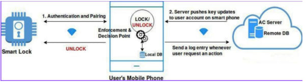
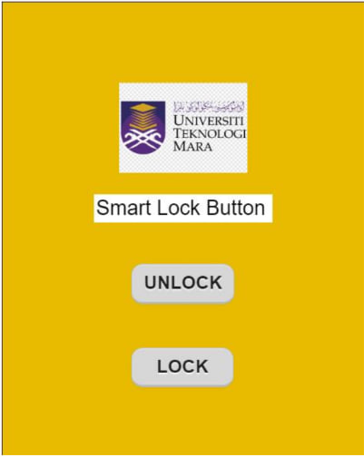

# Aizat's PortFolio

# [Project 1: Smart Lock for College Dormitory]

This project was done in the last year of my degree as my Final Year Project (FYP), and I completed my thesis for it.

* Basically, this smart lock needs credentials from the student to unlock their dorm.
* This project uses a User Acceptance Test for real-time data.
* The project uses Firebase as a database and Arduino IDE software for the smart lock system coding.
* The Project Write-up is on. [Google Drive](https://drive.google.com/drive/u/0/folders/1Ji4Nwgbun82o7UC3q4NQHcKVIgrBwR9-)

## Overview of the System Architecture

## Example of the interface for the smart lock apps

